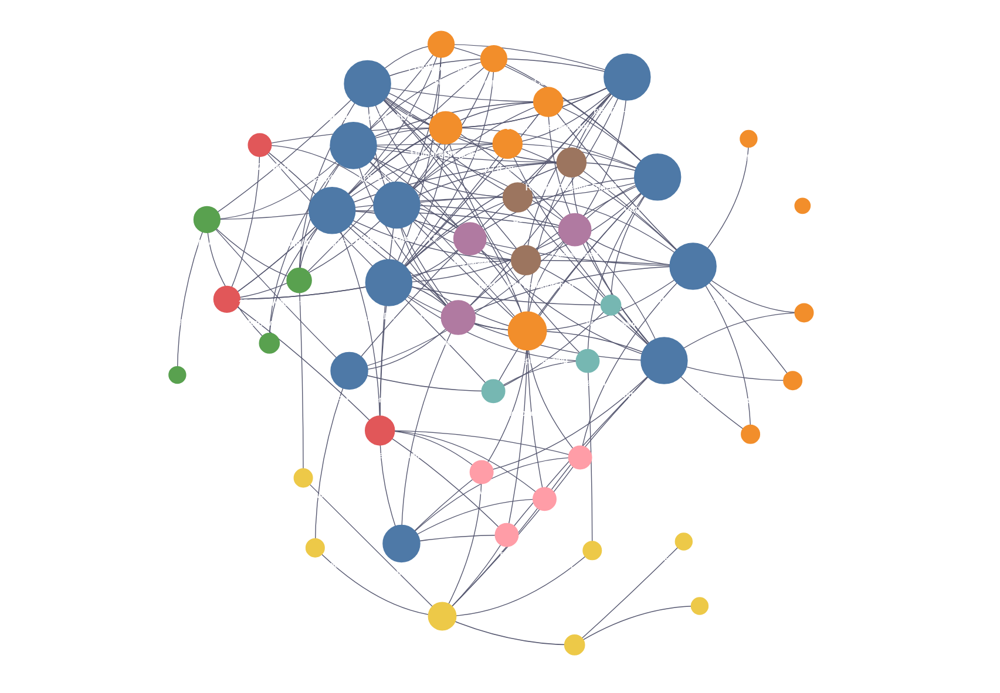

# pSADE-GNR

**Target-Aware State-Adaptive (p)-Dirichlet Graph Neural Regression for Non-Invasive Body-Composition Estimation**

This repository contains research code for predicting body-composition outcomes from non-invasive anthropometric measurements. The project studies participant-similarity graphs built in raw, variational-autoencoder (VAE), and Gaussian-mixture variational-autoencoder (GMVAE) representation spaces, with optional target-aware correlation weighting.

The principal prediction targets are:

* Appendicular lean mass (ALM)
* Bone mineral density (BMD)
* Body fat percentage (BFP)
* Age in exploratory experiments

## Method overview

Each participant is represented as a node. A (k)-nearest-neighbor graph connects participants with similar feature profiles. A neural encoder maps the node features to hidden states, and a state-adaptive (p)-Dirichlet energy-flow layer propagates information over the graph before regression.

The repository compares three representation spaces:

1. **Raw features** — standardized anthropometric measurements.
2. **VAE features** — a 15-dimensional variational-autoencoder representation.
3. **GMVAE features** — a 15-dimensional Gaussian-mixture VAE representation.

For each space, the project considers ordinary Euclidean graph construction and, where implemented, target-aware correlation-weighted graph construction. 

## Implemented models

| No. | Model | Representation | Graph distance | Propagation |
|---:|---|---|---|---|
| 1 | \(L^2\)-\(p\)SADE-GNR | Raw features | Euclidean | State-adaptive \(p\)-Dirichlet flow |
| 2 | cc-\(L^2\)-\(p\)SADE-GNR | Raw features | Correlation-weighted Euclidean | State-adaptive \(p\)-Dirichlet flow |
| 3 | VAE-\(L^2\)-\(p\)SADE-GNR | VAE latent space | Euclidean | State-adaptive \(p\)-Dirichlet flow |
| 4 | VAE-cc-\(L^2\)-\(p\)SADE-GNR | VAE latent space | Correlation-weighted Euclidean | State-adaptive \(p\)-Dirichlet flow |
| 5 | GMVAE-\(L^2\)-\(p\)SADE-GNR | GMVAE latent space | Euclidean | State-adaptive \(p\)-Dirichlet flow |
| 6 | GMVAE-cc-\(L^2\)-\(p\)SADE-GNR | GMVAE latent space | Correlation-weighted Euclidean | State-adaptive \(p\)-Dirichlet flow |
| 7 | Vanilla GMVAE-\(p\)SADE-GNR | GMVAE latent space | Euclidean | State-adaptive \(p\)-Dirichlet flow |
| 8 | Original \(p\)GNN—Primary | Raw features | Euclidean with exponential edge weights | Original `pGNNConv` |
| 9 | Original \(p\)GNN—Age | Raw features | Euclidean with exponential edge weights | Original `pGNNConv` |

## Installation

Python 3.10 or later is recommended. A CUDA-enabled PyTorch installation is recommended for the full hyperparameter sweeps, although the scripts can use a CPU.

Create and activate an environment:

python -m venv .venv
source .venv/bin/activate
python -m pip install --upgrade pip

Install the main dependencies:

pip install numpy pandas scipy scikit-learn matplotlib tqdm
pip install torch
pip install torch-geometric
pip install umap-learn kmapper

Choose the PyTorch command appropriate for your CUDA version from the official PyTorch installation guide when GPU support is required.

## Interactive model map

Open `graphify_all_9_models.html` in a web browser to explore the relationships among the nine model scripts, graph-construction choices, representations, targets, datasets, and evaluation components.

## Interactive model map

[Click here to open the interactive nine-model Graphify visualization](graphify_all_9_models.html).

### Model architecture overview

*Figure 1. Relationships among the nine pSADE-GNR models, datasets, representations, graph-construction methods, targets, and evaluation components.*

## Citation

If you use this repository, please cite the associated manuscript. 

@misc{drenska2026targetaware,
  title         = {Target-Aware State-Adaptive {$p$}-Dirichlet Graph Neural Regression for Non-Invasive Body-Composition Estimation},
  author        = {Nadejda Drenska and Matthew Lemoine and Gowri Priya Sunkara and Yu Wang and Sri Lakshmi Sravani Devarakonda and Steven B. Heymsfield},
  year          = {2026},
  eprint        = {2608.29496},
  archivePrefix = {arXiv},
  primaryClass  = {cs.LG},
  doi           = {10.48550/arXiv.2608.29496},
  url           = {https://arxiv.org/abs/2608.29496}
}

## Status

This repository contains research code under active development. Verify configurations, file paths, data permissions, and dependency versions before using it for reproducible experiments or clinical conclusions.

